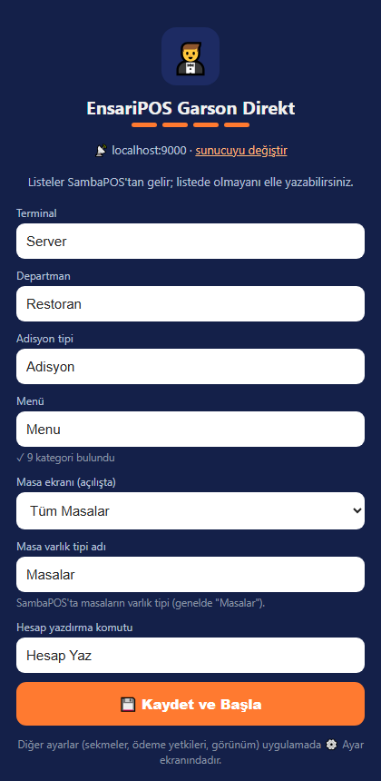
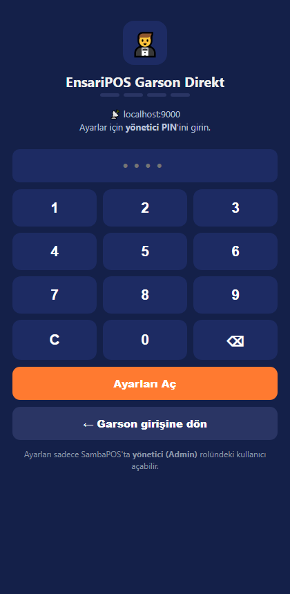

# EnsariPOS Garson — SambaPOS / AlfaPOS Garson Uygulaması

SambaPOS / AlfaPOS garson uygulaması (waiter app): masa, sipariş, ödeme. Web arayüzü, Windows servisi (C#), Android ve sunucusuz Garson Direkt.

> 🇬🇧 Waiter app for SambaPOS / AlfaPOS: web UI, Windows service, Android, and server-less "Garson Direkt".

> EnsariPOS ürünlerinden biridir · Tüm ürünler: https://github.com/yusuf631636/EnsariPOS

## Ekran görüntüleri

<p>
  
  
</p>

## Özellikler

- Masa ekranı, adisyon açma, sipariş ekleme (porsiyon/etiket)
- Hesap yazdırma, ödeme yetkileri (rol bazlı)
- Windows servisi (EnsariGarsonSrv) + telefon/tablet tarayıcısı
- Android uygulaması
- **Garson Direkt**: exe/sunucu gerekmez, telefon SambaPOS'a doğrudan bağlanır, sunucuyu kendisi bulur, garson sadece PIN girer

## Gereksinimler

- **Windows 10/11** veya Windows Server — SambaPOS'un kurulu olduğu bilgisayar ya da aynı ağdaki bir bilgisayar.
- **SambaPOS V5** veya **AlfaPOS** (SambaPOS tabanlı), SQL Server (Express) veritabanıyla.
- **SambaPOS Mesaj Sunucusu** açık ve erişilebilir (varsayılan port `9000`; Windows Güvenlik Duvarı'nda izinli).
- SambaPOS'ta **`EnsariGarson`** GraphQL istemci kaydı (ürünün kurulum paketi / hazırlık aracı otomatik ekler).
- SambaPOS'ta **Yönetici (Admin)** rolünde bir bağlantı kullanıcısı; kullanıcının **Şifre** alanı dolu olmalı (PIN değil).
- **C# sürümü** için: .NET Framework 4.7.2 veya üstü (Windows 10/11'de hazır gelir). Visual Studio gerekmez; derleme `csc.exe` ile yapılır.
- **Android uygulaması** derlemek için: JDK 17, Android SDK ve Cordova CLI (`npm i -g cordova`).
- **Kurulum paketi (setup.exe)** üretmek için: Inno Setup 6.

## Kurulum paketi

Hazır kurulum exe'si için önce ürünü derleyin, sonra depodaki `*.iss` betiğini **Inno Setup 6** ile derleyin.

## Kaynak koddan çalıştırma

```
git clone https://github.com/yusuf631636/EnsariPOS-Garson.git
cd EnsariPOS-Garson
```

**C# / .NET Framework 4.x** (`srv`) — Visual Studio gerekmez, Windows'un kendi derleyicisi (`csc.exe`) kullanılır:

```
cd srv
powershell -ExecutionPolicy Bypass -File derle.ps1      # EnsariGarsonSrv.exe üretir (..\ortak\*.cs dahil)
EnsariGarsonSrv.exe /console                                 # servis olarak değil, konsolda çalıştırır
```

**Android** (`apk`, `apk-bagimsiz`): JDK 17, Android SDK ve Cordova gerekir; klasördeki `derle.ps1` derleme adımlarını içerir. İmza anahtarları depoda yoktur.

**Kurulum paketi**: `*.iss` dosyaları Inno Setup betikleridir.

## Klasörler
| Klasör | İçerik |
|---|---|
| `www` | Garson web arayüzü |
| `srv` | EnsariGarsonSrv Windows servisi (C#) — www klasörünü sunar ve SambaPOS'a bağlar |
| `apk` | Android uygulaması (servisle çalışır) |
| `apk-bagimsiz` | Garson Direkt: servis/exe gerekmez, telefon SambaPOS'a doğrudan bağlanır |

## Sık karşılaşılan sorunlar

**"Authorization is required … getUser"** — Bağlantı kullanıcısı SambaPOS'ta Yönetici rolünde değil. Kullanıcıyı Yönetici rolüne alın.

**"invalid_client" / "uygulama kaydı yok"** — SambaPOS'ta `EnsariGarson` istemci kaydı eksik. Ürünün hazırlık aracını SambaPOS bilgisayarında bir kez çalıştırın.

**"Bağlantı kullanıcısı adı/şifresi hatalı"** — SambaPOS kullanıcısının **Şifre** alanını yazın, PIN'i değil.

**"SambaPOS mesaj sunucusuna ulaşılamadı"** — SambaPOS ve Mesaj Sunucusu açık mı, port `9000` güvenlik duvarında açık mı, adres doğru mu kontrol edin.

**"Terminal kaydı alınamadı"** — Ayarlardaki departman / adisyon tipi / terminal adı SambaPOS'takiyle birebir aynı olmalı.

## Güvenlik

`config.json`, veritabanları, loglar, imza anahtarları ve müşteri verileri depoya eklenmez (`.gitignore`); örnek ayarlar `config.example.json` dosyalarındadır. Güvenlik açığı bildirimi: [SECURITY.md](SECURITY.md).

## Katkı

Katkılar Pull Request ile gelir ve proje sahibi onaylayınca birleştirilir — bkz. [CONTRIBUTING.md](CONTRIBUTING.md).

## Lisans

MIT — bkz. [LICENSE](LICENSE).
